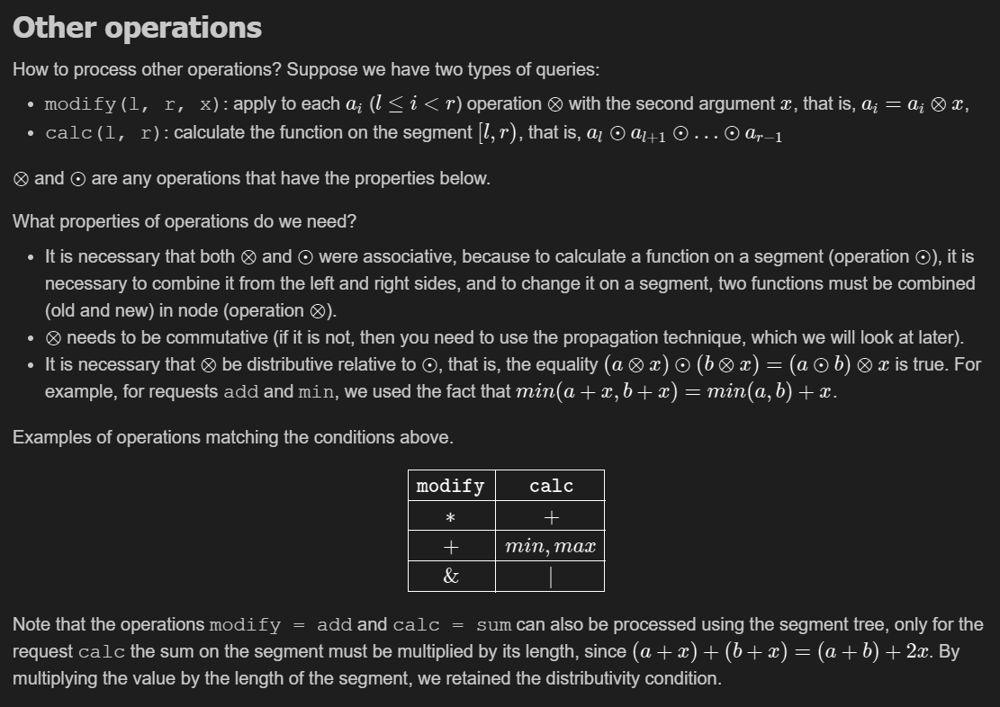

# Segment Trees



### SET one element and SUM queries

```cpp

struct segtree {
    int size;
    vector<long long> sums;

    void init(int n) {
        size = 1;
        while (size < n) size *= 2;
        sums.assign(2 * size, 0LL);
    }
    // SET TAKES INDEXING FROM 0
    void set(int i, int v, int x, int lx, int rx) {
        if (rx - lx == 1) {
            sums[x] = v;
            return;
        }
        int m = (lx + rx) / 2;
        if (i < m) {
            set(i, v, 2 * x + 1, lx, m);
        } else {
            set(i, v, 2 * x + 2, m, rx);
        }
        sums[x] = sums[2 * x + 1] + sums[2 * x + 2];
    }
    void set(int i, int v) {
        set(i, v, 0, 0, size);
    }
    // SUM TAKES INDEXING FROM [L,r)
    long long sum(int l, int r, int x, int lx, int rx) {
        if (lx >= r || l >= rx) return 0;
        if (lx >= l && rx <= r) return sums[x];
        int m = (lx + rx) / 2;
        long long s1 = sum(l, r, 2 * x + 1, lx, m);
        long long s2 = sum(l, r, 2 * x + 2, m, rx);
        return s1 + s2;
    }

    long long sum(int l, int r) {
        return sum(l, r, 0, 0, size);
    }
};
```

```cpp
    void build(vector<int> &a, int x, int lx, int rx) {
        if (rx - lx == 1) {
            if (lx < (int)a.size()) {
                sums[x] = a[lx];
            }
            return;
        }
        int m = (lx + rx) / 2;
        build(a, 2 * x + 1, lx, m);
        build(a, 2 * x + 2, m, rx);
        sums[x] = sums[2 * x + 1] + sums[2 * x + 2];
    }
    
    void build(vector<int> &a) {
        build(a, 0, 0, size);
    }
```

### SET one element and MIN queries

```cpp
struct segtree {
    int size;
    vector<int> minimums; 

    void init(int n) {
        size = 1;
        while (size < n) size *= 2;
        minimums.assign(2 * size, 0LL);
    }

    void build(vector<int> &a, int x, int lx, int rx) {
        if (rx - lx == 1) {
            if (lx < (int)a.size()) {
                minimums[x] = a[lx];
            }
            return;
        }
        int m = (lx + rx) / 2;
        build(a, 2 * x + 1, lx, m);
        build(a, 2 * x + 2, m, rx);
        // CHANGE LOGIC
        minimums[x] = min(minimums[2 * x + 1],minimums[2 * x + 2]); 
    }

    void build(vector<int> &a) {
        build(a, 0, 0, size);
    }

    void set(int i, int v, int x, int lx, int rx) {
        if (rx - lx == 1) {
            minimums[x] = v;
            return;
        }
        int m = (lx + rx) / 2;
        if (i < m) {
            set(i, v, 2 * x + 1, lx, m);
        } else {
            set(i, v, 2 * x + 2, m, rx);
        }
        // CHANGE UPDATE
        minimums[x] = min(minimums[2 * x + 1] , minimums[2 * x + 2]);
    }
    void set(int i, int v) {
        set(i, v, 0, 0, size);
    }

    int mini(int l, int r, int x, int lx, int rx) {
         // CHANGE THE DEFAULT
        if (lx >= r || l >= rx) return INT_MAX;
        if (lx >= l && rx <= r) return minimums[x];
        int m = (lx + rx) / 2;
        int s1 = mini(l, r, 2 * x + 1, lx, m);
        int s2 = mini(l, r, 2 * x + 2, m, rx);
        // CHANGE THE UPDATE
        return min(s1 , s2);
    }

    int mini(int l, int r) {
        return mini(l, r, 0, 0, size);
    }
};
```

### Maximum SUM SUBARRAY queries

```cpp
struct value {
    int prefix;
    int suffix;
    int segment;
    int totalSum;

    value() { // IDENTITY FUNCTION
        prefix = suffix = segment = totalSum = 0;
    }

    value(int n) {
        prefix = suffix = segment = totalSum = n;
    }

    static value update(value &a, value &b) {
        auto out = value();
        out.prefix = max(a.prefix, a.totalSum + b.prefix);
        out.suffix = max(b.suffix, b.totalSum + a.suffix);
        out.segment = max({a.segment, b.segment, a.suffix + b.prefix});
        out.totalSum = a.totalSum + b.totalSum;
        return out;
    }
};

struct segtree {
    int size;
    vector<value> values;

    void init(int n) {
        size = 1;
        while (size < n) size *= 2;
        values.resize(2 * size);
    }

    void build(vector<int> &a, int x, int lx, int rx) {
        if (rx - lx == 1) {
            if (lx < (int)a.size()) {
                values[x] = value(a[lx]);
            }
            return;
        }
        int m = (lx + rx) / 2;
        build(a, 2 * x + 1, lx, m);
        build(a, 2 * x + 2, m, rx);
        values[x] = value::update(values[2 * x + 1], values[2 * x + 2]);
    }

    void build(vector<int> &a) {
        build(a, 0, 0, size);
    }

    void set(int i, int v, int x, int lx, int rx) {
        if (rx - lx == 1) {
            values[x] = value(v);
            return;
        }
        int m = (lx + rx) / 2;
        if (i < m) {
            set(i, v, 2 * x + 1, lx, m);
        } else {
            set(i, v, 2 * x + 2, m, rx);
        }
        values[x] = value::update(values[2 * x + 1], values[2 * x + 2]);
    }

    void set(int i, int v) {
        set(i, v, 0, 0, size);
    }

    value query(int l, int r, int x, int lx, int rx) {
        if (lx >= r || l >= rx) return value();
        if (lx >= l && rx <= r) return values[x];
        int m = (lx + rx) / 2;
        auto s1 = query(l, r, 2 * x + 1, lx, m);
        auto s2 = query(l, r, 2 * x + 2, m, rx);
        return value::update(s1, s2);
    }

    value query(int l, int r) {
        return query(l, r, 0, 0, size);
    }
};
```


### TRAVERSING Segment Trees

- Finding the the first k th one index in binary array. Uses SUM sts. 

```cpp
    int query(int index, int x, int lx, int rx) {
        if (rx - lx == 1) {
            return lx;
        }
        int m = (lx + rx) / 2;
        int sl = sums[2 * x + 1];
 
        if (index < sl) {
            return query(index, 2 * x + 1, lx, m);
        } else {
            return query(index - sl, 2 * x + 2, m, rx);
        }
    }
 
    int query(int index) {
        return query(index, 0, 0, size);
    } 
```

- Finding the the first index where number is $\ge x$ . Uses MAX sts
  
  ```cpp
      int query(int index, int x, int lx, int rx) {
          if (rx - lx == 1) {
              return lx;
          }
          int m = (lx + rx) / 2;
          int sl = sums[2 * x + 1];
   
          if (index < sl) {
              return query(index, 2 * x + 1, lx, m);
          } else {
              return query(index - sl, 2 * x + 2, m, rx);
          }
      }
   
      int query(int index) {
          return query(index, 0, 0, size);
      }
  ```
